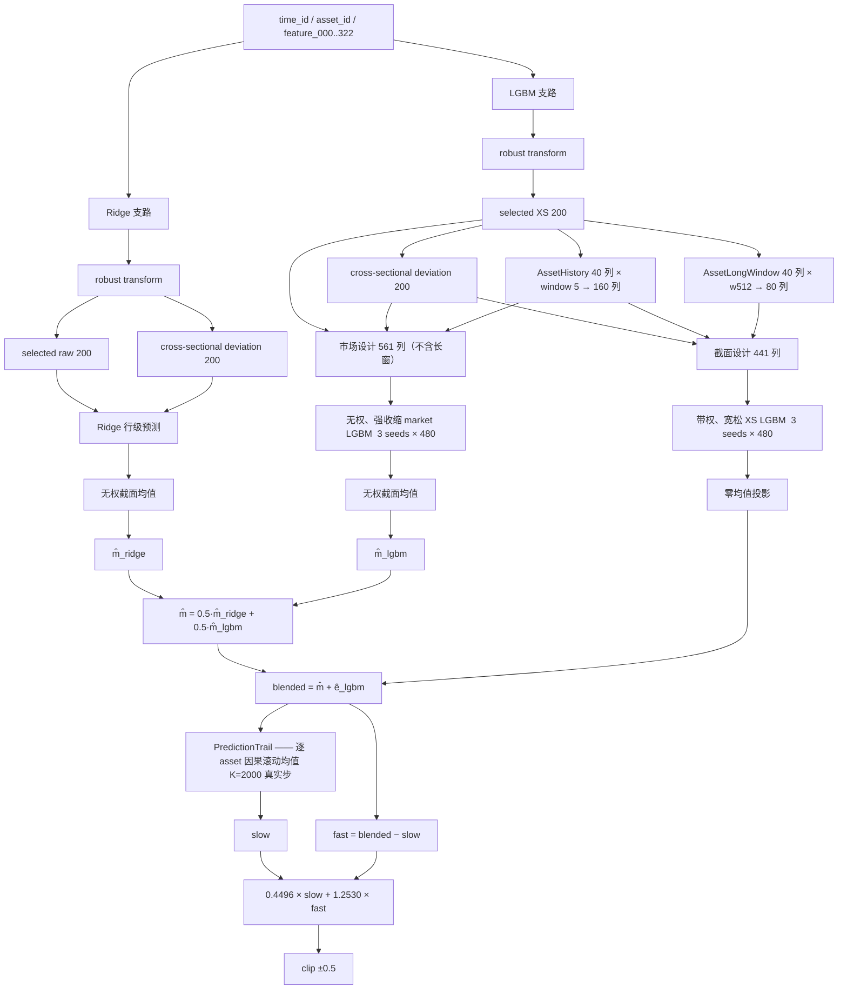

# ARCHITECTURE.md — 这套结构为什么长成这样

> 这是一份**架构史与推理链**，不是代码说明书，也不是实验结果的堆积。
> 每一处结构都尽量回答三个问题：当时观察到什么、为什么这样改、以及它给交付留下了什么约束。
>
> **状态：2026-09-01，赛程收官。** 8/31 已上传私榜策略文件
> `outputs/v3_hybrid_submission_20260829.zip`（sha `d934d246…`，13 文件）。
> ⚠️ **交付模型没有公榜分数** —— 它在公榜停更后用回补标签重训，采纳依据是密封期裁决而非榜分。
> 当前数值一律以 `strategies/v3_hybrid/model/hybrid_meta.json`、
> `outputs/promotions/*/promotion_manifest.json` 和 [`experiments/ledger.csv`](experiments/ledger.csv) 为准。

## 这一版相对 2026-08-20 那版的实质变化

上一份架构文档写于 08-20，停在「密封期尺子还是预注册」的那一天。此后发生的事它一条都没有：

1. **长窗 w512 进入截面块**（§3.6）—— 截面设计 361 → **441 列**，公榜 **0.0041833953**（+1.662%）。
   它的价值不只在那 1.66%：`long_history_probe` 一次加 240 列判 `REJECTED`，
   拆成单窗 80 列后同一个评价器给 +5.75% ⟹ **信号一直在，是被列数的估计代价淹掉的**。
2. **⭐ scale 这一章重写**（§4）—— 旧文只讲了全局 scale 和 slow/fast。
   真正该讲的是**沿哪条轴分区才值得各给一个 scale**：时间尺度成立，
   而 market/cross 两块、phase、per-asset 三条轴各自被独立否掉。判据也随之写死。
3. **扩展数据全量重训转正**（§6）—— 训练段 `time_id 0–1,105,919`、3,289,030 行（+24.3%）。
   旧文那句「没有任何候选在等待裁决、生产就是 `v3_hybrid_slowfast`」已作废。
4. **密封期尺子标定完成**（§5.4）—— 结论是两条且方向相反：排序 **Spearman ρ=1.0（满分）**，
   区间**几乎没有牙**（连公榜低 14.49% 的臂 CI 都跨 0）⟹ **用序不用值**。
5. **交付层加了两条最贵的教训**（§8.6–8.8）—— `num_threads` 会在评测机上慢 **74.50×**（端到端实测）、
   撞穿总超时并把 **86% 的 `time_id` 填 0**；而**四次全量交付验证全都没抓到**，
   因为它们量的正是一个不随提交包走的环境变量。
6. **时间线、被否决表、证据索引同步到 09-01**，并补上 peer 对轴（判 `INCONCLUSIVE` 而非
   `REJECTED`）、选列准则、函数类、长历史窗、种子数五个新探针。

---

## 0. 如何读这份文档

### 0.1 每一次结构变化的叙述顺序

```text
观察到的问题
→ 假设
→ 数学/统计动机
→ 最小实验
→ 验证口径
→ 结果
→ 最终决策
→ 留下的工程约束
```

这条顺序不是文体偏好。在 R² ≈ 0.004 的低信噪比时间序列上，「某次分数变高」并不自动等于
「发现了新信号」，它可能来自：scale 改好了、预测能量 B 变大了、验证窗口碰巧有利、
phase 或时间分布不一致、训练和验证发生了泄漏，或者模型只是变得更激进。

### 0.2 三类收益不能用同一把尺子判

| 类别 | 例子 | 判法 |
|---|---|---|
| ① 后处理 / 校准 | `prediction_scale`、`blend_weight`、slow/fast 系数 | 闭式可解，看 `peak = A²/B` 与配对增量 |
| ② 容量 | alpha、树轮数、叶子数、`min_data_in_leaf` | ⚠️ 本地尺子在这条轴上**三次与公榜量反** |
| ③ 信息 | history、market/cross 分解、长窗、资产特定结构 | 看机制拆解 `2ΔA > ΔB` 与迁移率 |

### 0.3 两条 08-20 之后才长出来的方法论（本次重写最该补的部分）

**(a) 每个测量都要配一个能失败的归属检查，且它必须独立于被测量本身。**
2026-08-24 一天之内同型四次：密封期标定跑的是候选目录的占位参数而不是有公榜真值的那个模型；
Stage C 读的缓存建于回补窗口之前；重训候选缺三个键被静默降级；D2b 的折版图让验证段落在新数据
之前。三种有效形式：**对已知真值**（新算预测 vs 留档公榜 CSV 的 `max|pred|`）、
**零对照**（构造上必须给 0 的那一格）、**口径边界**（缓存/数据根的 `time_id` 范围）。

**(b) 判据要跟着比较的「轴」走 —— 定判据前先问：这次比较只变了一个东西吗？**
逐位指纹 `predictions_sha256` 只在**同机**比较里成立；跨机器有一条已量过的浮点轴
（同机换后端 1.4e-15、**同后端换机器 2.3e-8**），指纹必然不同。2026-08-29 我预告「云端指纹
必须等于本地的」，实测不等 —— 落在已知轴上，**判据本身写错了**。

完整的 19 条长期伤疤规则见 [`CLAUDE.md`](CLAUDE.md) §8，本文件不复述。

### 0.4 冲突时的可信度顺序

`代码/模型产物/manifest/ledger` > `实验 JSON/Markdown` > `ROADMAP` > `NOTES` >
`research_history` **与本文件**。历史文件（包括本文件）只说明「当时为什么这样判断」，
**不能覆盖当前产物真值**。

---

## 1. 任务、指标与约束：为什么这是一个难问题

### 1.1 数据与接口

训练数据是一个时间面板 `time_id × asset_id × feature_000..feature_322`（15 个匿名标的），
每行还带 `weight`、`target` 和 47 个 `responder_*`。但**推理阶段只有**：

```text
time_id
asset_id
feature_000 ... feature_322
```

`weight`、`target`、`responder_*` 在线上都不可用 —— 不是「不方便拿」，是
`strategies/v3_hybrid/main.py` 的 `forbidden` 集合与官方 `timeseries_api/runner.py`
在交给 `predict()` **之前**就把它们剥掉了。这条事实后来直接否掉了一个已经过五道门禁的候选（§7 peer 对轴）。

官方 Time-Series API 按递增 `time_id` 调用 `predict`，一次给出当前 `time_id` 的完整资产截面。
这个接口决定了模型必须是**时间因果的**、**能维护跨调用状态**、**不能依赖未来行**、
**不能依赖训练期才能看到的 weight/target**。

### 1.2 指标：加权零均值 R²，以及它的两个推论

```text
Score = 1 − Σ w_i (y_i − ŷ_i)² / Σ w_i y_i²
```

与普通回归的差别：没有额外截距拟合、全零预测得 0、**预测 scale 显著影响分数**、
预测过于激进会让分母方向的 B 增长太快。所以「相关性变强」不够，还必须以合适的幅度预测。

**推论一：分数是 IC 的平方，读排行榜差距时必须换算。** 在最优 scale 处 `Peak = A²/B`，
而这正是加权相关系数的平方：

```text
Peak = IC²        IC = sqrt(Peak)
```

以 2026-08-21 的状态为例：我们 0.0041833953（IC 0.06468），榜首 0.0060（用户报告，IC 0.07746）
⟹ score 差 **+43.4%**，但 **IC 只差 +19.7%**。若该差距来自一个完全独立的新信号，
该信号单独打分约 0.0018 —— 是「多一个同量级的独立信号源，或同样信息的提取效率高约 20%」，
**不是数量级差距**。用 score 的 +43.4% 去描述差距会系统性地把问题说得更绝望。

**推论二：榜首分数是其真实边际的上界。** 公榜每天最多 5 次成功评分、7/1–8/23 共 54 天
⟹ 最多约 270 次；本项目一共只用了 31 次（ledger 全部行）。在 R² ≈ 0.004 的信号上做几百次
公榜选型，本身就是在硬拟合公榜时期。而私榜是 9/1–9/30 的**实盘前向**评估，另一个时期，排名会重排。

### 1.3 私榜规则：最新提交版本生效，不是 best-of-10

主办方原文（`docs/competition_description.md:241`）：最多 10 次策略文件提交，
**最终采用最新提交版本**。

```text
best-of-10 的世界   交一组分散候选由主办方挑    ⟹ 高方差候选有期权价值
实际的世界         最后一次上传的就是最终答案   ⟹ 高方差候选是纯风险
```

⟹ 10 次是**上传失败/包损坏的重试余量**。两条硬约束：任何实验性变体都不能最后上传；
想试的东西必须在 8/23 公榜停更之前用公榜试完。收尾顺序本身因此成了纪律
（见 [`RUNBOOK_8_23.md`](RUNBOOK_8_23.md) §D6 上传日卡片）。

### 1.4 运行约束（2026-08-29 主办方补全）

```text
4 核 / 12 GB / 无网络
--model-init-timeout-seconds 180
--total-timeout-seconds (0.05 + a) * n_time_id + b     # a、b 均未给值，但都 ≥ 0
```

超时之后 `timeseries_api/runner.py:186-188` 置 `aborted_after_timeout`，
**其后所有 `time_id` 保持默认值 0**。主办方同时新增一节要求策略代码内部手动设 `num_threads` ——
那一条差点让整个赛季白打，见 §8.6。

### 1.5 真正困难的地方

不是「模型不够大」，而是下面几项同时存在：

1. target 的低信噪比；
2. 323 个匿名特征，无法凭语义挑选；
3. target 同时包含市场共同成分与资产相对成分；
4. 时间段之间存在漂移（公榜期内部就漂了 **+49%**，见 §5.6）；
5. 本地 OOF 与公榜对容量参数可能给出相反判断；
6. 训练端有 `weight`，线上没有；
7. 线上 history 状态必须与离线训练逐位一致；
8. 树模型对浮点计算顺序极度敏感（差一个 float32 ULP 就翻叶子）；
9. ⭐ **测量的关键口径可能不在交出去的那件东西里**（§8.6）。

---

## 2. 当前结构总览

### 2.1 数据流



### 2.2 三个设计矩阵，以及为什么它们不一样

| 块 | 设计矩阵 | 列数 | 训练目标 | 权重 |
|---|---|---:|---|---|
| Ridge（**冻结**） | `raw200 ‖ xs_dev200` | 400 | 行级 `y` | 带权拟合 |
| 截面 LGBM | `xs_dev200 ‖ history160 ‖ long_window80 ‖ asset_id` | **441** | `e = y − mean_i(y)` | **带权** |
| 市场 LGBM | `raw200 ‖ xs_dev200 ‖ history160 ‖ asset_id` | **561** | 行级 `y`，只取截面均值 | **不带权** |

- `history160` = 40 个位置 × 4 个块（`previous` / `difference` / `rolling_mean(5)` / `rolling_deviation`）。
- `long_window80` = 同样 40 个位置 × 2 个块（w512 的 `rolling_mean` / `current − rolling_mean`）。
- ⚠️ **长窗只进截面设计，市场设计一列不动**（`main.py` 里 `market_design` 用的是**未加长窗**的
  `blocks`）。`long_window` 缺键或为 `null` ⟹ 完全关闭 ⟹ 与旧模型逐位相同。
- ⚠️ `asset_id` 必须留在最后一列；长窗块插在 history 之后、`asset_id` 之前，与 `train.py` 逐列对应。

### 2.3 三处跨 `predict` 的状态

这是这套架构最容易出事的地方：**它们是模型身份的一部分，但都不在任何模型文件里**。

| 对象 | 窗口 | 内存代价（P11 实测） | 缺了会怎样 |
|---|---|---|---|
| `AssetHistory` | 5 次观测 | 随 15 个资产固定 | 列宽对不上，推理期报错 |
| `AssetLongWindow` | 512 次观测 | 固定 **2.46 MB** | 列宽对不上，推理期报错 |
| `PredictionTrail` | 2000 个**真实** `time_id` 步 | **314.6 B / time_id**（唯一无界；公榜期 64 MB，余量 8.4 倍）| ⚠️ **静默关掉、不抛错**，退回单一 scale 的旧行为 |

最后一行那个「静默」直接催生了 §8.2–8.3 的一整套身份门禁。

### 2.4 模型身份：13 个键

`scripts/promote_v3_candidate.PUBLIC_BASELINE` 是整条链路**唯一**的模型身份定义，
四个消费者（打包 / 审计 / 转正 / 交付验证）都从它派生，任何一个键变化都视为**新模型**：

```text
blend_weight   num_iteration   market_num_iteration   market_lambda
cross_section_weighted   n_seeds   history_window   long_window
prediction_scale   prediction_clip
slow_fast_window   slow_fast_slow_relative   slow_fast_fast_relative
```

**具体数值不在本文件维护** —— 见 `strategies/v3_hybrid/model/hybrid_meta.json`，
它的每个 `*_note` 字段还写着该项的采纳证据与否决理由。

代码位置索引见 §12。

---

## 3. 为什么是这个结构 —— 逐块来历

### 3.1 Ridge 底座，以及为什么至今冻结不重训

最早的生产模型是纯 Ridge：200 个匿名特征 + 截面去均值，公榜起点 **0.00119088**。
选它当第一基线的理由很朴素：对匿名高维特征稳定、训练快、能直接加正则、便于严格复现。

设计矩阵不是只放 raw，也不是只放 dev，而是 `[raw | raw − mean_t(raw)]` ——
raw 表达当前共同市场水平与资产绝对状态，dev 表达同一时刻资产相对于其他资产的位置。
这一步已经隐含了后来一直保留的分解：`prediction = market + cross`。

⭐ **严格求解器（LSQR `tol=1e-8` / `max_iter=2000`）解决的不是分数，是模型身份。**
早期宽松配置下不同 BLAS 线程数会造成系数漂移 4.80e-05；换严格解后降到 4.47e-07（改善 107×）。
它回答的是：两次重训是否得到同一个模型、两点法比较的是不是同一个模型、
promotion 前后的身份能否校验。**它是研究基础设施，不是信号增强器。**

⚠️ **到最后一次重训，Ridge 仍是逐字节冻结拷贝**（`54dc6afb…`）。这是有意的：
扩展数据重训时不动它，候选与基准的**唯一差别**才是训练数据（§6）。

### 3.2 market / cross 加性分解：为什么必须无权、为什么必须二次投影

```text
m_t  = mean_i(y_it)          市场共同分量
e_it = y_it − m_t            截面（资产相对）分量
```

`FACT`（2026-08-08，九个训练分区实测）：市场共同分量占 target 方差 **0.626–0.732，
均值 68.4% ± 3.4%**。证据：`outputs/experiments/mt_diagnostics.md`。

**为什么全程无权**：推理端拿不到 `weight`（test 无该列，且 runner 的 `forbidden` 会剥掉）
⟹ 拆解、投影、市场聚合一律用**无权**均值。这不是简化，是口径必须与线上一致。

**为什么树的输出必须再投影一次**：`ê_raw` 不保证零均值。不投影的话，
截面块会把一部分伪 market 分量混进独立建模的 market 里，破坏组件分工：

```text
ê_it = ê_raw_it − mean_i(ê_raw_it)
```

⭐ **占分比已经翻转**：当前 OOF 上 market : cross = **41.2% : 58.8%**
（bootstrap CI [27.5%, 53.1%]）。08-10 记的 60.1%/39.9% 标 `SUPERSEDED` ——
那是**公榜**三点解方程的产物，且当时模型还在 history40 与行级市场森林**之前**。
⚠️ 新旧两个数分属 OOF 与公榜两把尺子，不能宣称推翻了公榜测量。
证据：`outputs/experiments/v3_block_ceiling_3s480.md`。

⭐ 顺带量过一个容易被误用的比值：cross 块的**收割率**是 market 块的 2.62×，
但 market 块每提升一点 R² 值 **2.460×** 的分。乘积接近 1
⟹ **OOF 没有给出明确的精力偏向**，两块的边际价值接近平手。

### 3.3 为什么引入 LightGBM，以及为什么最后是全替换

Ridge 对市场方向相对稳定，但资产截面 residual 里存在 asset × feature 交互、非线性阈值、
history 与当前 deviation 的组合、资产异质性 —— 这些是树比线性更擅长的部分。
所以没有直接用 LGBM 替换全部 Ridge，而是分工：**Ridge 负责稳定的 market 基底，
LGBM 负责 cross residual**。

早期是保守的 `0.5 × Ridge cross + 0.5 × LGBM cross`，用来确认 LGBM cross 是否真的有效。
公榜验证后定为 `blend_weight = 1.0`，即**完全替换**（0.0022857726 → 0.0024872338，
不重训、只改一个参数）。⚠️ 这是旧文档最容易误导人的地方：早期文档长期把 v3 描述成「五五混合」。

### 3.4 history40 / window5：项目至今最大的一次跳变

对每个 asset 保存过去最多 5 次观测，构造四个块：

```text
previous          = 最近一次历史值
difference        = current − previous
rolling_mean      = 过去历史均值，不包含 current
rolling_deviation = current − rolling_mean
```

公榜 **0.0026330806 → 0.0032523499**（+23.47%），本地配对 peak +10.10%、5/5 折、
去最好折 +9.10%、`2ΔA > ΔB`。证据：`outputs/experiments/history_peak_lgbm_scoped.md`。

**三条留下来的工程约束：**

1. **必须在全部原始行上推进状态，再用采样掩码决定保留哪些行。** 面板可能缺资产、
   时间点之间不连续、训练用 phase-balanced 采样 ⟹ 先采样再算 lag，会跳过真实的上一观测，
   使训练端与线上端的历史定义不一致。绝不能对采样后的矩阵做 `groupby.shift(1)`。
2. **离线 `transform()` 与在线 `transform_online()` 必须逐位相同** —— 相同窗口、相同状态、
   相同冷启动行为（无历史一律按 0）、相同 float64 累加 + 最后一次性 round 回 float32。
   在 float32 里累加会与整块路径差一个 ULP，而树是阶跃函数：实测同类差异被放大到
   `max|Δpred| = 2.85e-03`（0.52% 的行）。
3. **同样的特征进 Ridge 是 −1.97%，进 LGBM 才成立。** 不能把「一个特征对 LGBM 有效」
   理解为「它对所有模型都有效」—— history 信息依赖非线性与资产/截面交互。

⚠️ **history80 被放弃**：本地看起来更好，公榜与 history40 **完全打平**且更慢
（ledger `hist_c80` 行，公榜 0.00%）⟹ 保留 history40。

### 3.5 第二片市场森林：为什么不带权、为什么要收缩

Ridge market 稳定，但可能遗漏非线性共同状态。于是增加一片**行级** market forest：
训练标签是行级 `y`，但最终只取每个 `time_id` 的**无权截面均值** `m̂_lgbm(t)`，
再与 Ridge 的市场估计按 `λ = 0.5` 混合。

**为什么不带权**：线上和最终 market 聚合都用无权均值。实测带权训练反而从 +15.18% 掉到
+11.63%（`combo_market_weight` 的 `mkt_wm` 格）—— weighted loss 与最终无权聚合目标不一致。
而 XS forest 带权**有**收益，因为它直接影响逐行比赛误差。于是形成不对称配置：

```text
XS：     weighted training
market： unweighted training
聚合：   unweighted mean
```

**为什么容量方向相反**：XS 的输出直接进入最终预测，需要足够容量捕捉资产交互；
market forest 虽然训练 `y`，但最后只保留截面均值 —— **行级截面变化会被聚合丢掉**。
太松就是把容量花在最终会被丢弃的东西上。公榜证据：

```text
mkt_we       0.0039673997      market 中档
mkt_moderate 0.0039867107
mkt_shrunk   0.0039977510      ⭐ market 收缩更好
xs_shrunk    0.0035771492      ❌ 截面收缩 −9.84%
r960         0.0037609312      ❌ 两片森林同时 480→960，−5.20%
```

⟹ **market 收缩、XS 放开、轮数 480 是内部极值**（旧结构 320 轮下降、新结构 960 轮下降，
且 960 那次触了 clip）。`λ = 0.5` 是先验、不拟合：解开它 OOS **−1.62%**、2/4 折、
去最好折 −6.17%。市场森林独立截短（160~480）全部 FAIL、`Selected: None`。

### 3.6 ⭐ 长窗 w512：信号一直在，是被列数的估计代价淹掉的

**观察**：生产 history 只有 `window=5`，而 slow/fast（§4.3）证明**预测**在 K=2000 真实步的
尺度上还有结构。那么**特征**侧的长窗有没有信息？

**第一次尝试失败了，但失败的方式很重要。** `long_history_probe` 一次加 **240 列**
（40 特征 × 窗口 {64, 512, 4096} × {滚动均值, 偏离}）：pooled +0.69%、去最好折 −0.49%、
CI 下界 −5.96% ⟹ `REJECTED`。但那个设计把「信号」和「估计代价」焊死了 ——
分不清「长窗里没信号」和「有信号但被 240 列的方差淹掉」。

**拆开来测（列数降到 1/3，每臂 80 列）**，预注册在先（`long_window_ladder_plan.json`，
sha256 `4d9aeb2b44fa…`）：

| 臂 | pooled Δpeak | 正折 | 去最好折 | CI 下界 | 超检出下限 | 判定 |
|---|--:|--:|--:|--:|:--:|:--:|
| **`w512`** | **+6.80%** | **5/5** | +5.84% | +3.87% | ✅ 1.12× | **五道全过** |
| `w4096` | +3.43% | 4/5 | +2.32% | +0.71% | ❌ | 低于下限 |
| `w64` | +4.51% | 3/5 | +2.76% | −0.05% | ❌ | ❌ |

⭐⭐ **预注册的机制预测兑现了。** 在**同一个评价器（线性）**上做同一件事：

```text
240 列（三窗合一）  →  +0.69%
 80 列（单窗 512）  →  +5.75%
```

⟹ **信号一直在，是被 240 列的估计代价淹掉的。**
`w512` 也是唯一两个评价器（树与线性）都认的臂 ⟹「哪个窗口」只在 512 上被稳健识别。

**确认档（3s480，只跑截面块）**：pooled **+7.77%**、**5/5 折**、去最好折 +6.49%、
配对 CI 下界 +4.18% —— 五道门槛全过，但只有 3s480 检出下限的 **0.89×**
⟹ `PASS_BUT_BELOW_DETECTION_FLOOR`：**方向可信、幅度测不出**，
按预注册「只够作为花一次公榜额度的理由，不构成晋级依据」。

**公榜裁决**：`0.0041150085 → 0.0041833953`，**+1.662%**，新最好成绩。
同 scale、两份 CSV 均 0 行触限 ⟹ 二次式精确，这个比较不依赖任何近似。
`Σp²` 实测**上升** 1.28% ⟹ 排除了「最优 scale 上移导致 1.16 处低估新模型」这个猜想。
⚠️ 迁移率只有 **0.22×** —— 见 §5.3，这是一条要认真对待的反向读数。

**留下的工程约束**：探针的滚动均值用 float64 `cumsum`（研究口径），
而生产 `AssetLongWindow` 必须用**持久累积和相减**，保证离线整块与在线逐 `time_id` 逐位相同。
两者**不可互换**；照搬探针实现会过不了 `check_consistency`。

### 3.7 选列 200：现在有实证支撑，且这条轴三向封死

三处选列都用同一个单变量筛子（`|加权 Pearson 相关|` 取 top-N，只在训练折内拟合）：

```text
ridge_selected     top-200 by |corr(feature, y)|  加权   → Ridge
xs_selected        top-200 by |corr(feature, e)|  无权   → 截面块 **和** 市场块
history_positions  top-40 within xs_selected             → history 块与长窗块
```

这看起来像个明显的漏洞：**判据是线性、单变量、边际的，而下游是 GBM**，
它对「单独看没用、交互才有用」的特征完全失明 —— 结果是 123 个原始特征从未进过任何模型，
且截断处 200th→201st 的落差只有 1.33%，**没有断崖**。

⭐ **但三个方向的实测同时封死了这条轴**：

| 方向 | 实验 | 结果 |
|---|---|---|
| **更宽**（323 全给） | `feature_screen_1s160` | `xs323` −1.00% / `mkt323` +1.09%（0.70× 下限）/ `both323` +0.10% ⟹ 全不过 |
| **history 更宽**（top-80 超集） | ledger `hist_c80` | 公榜 **0.00%**（完全打平）且更慢 |
| **换准则**（LASSO / 滞后准则） | `selection_criterion_probe` | −1.29% / −4.38%（0/5）/ −10.39%（0/5） |

⭐ 第三项还有一条漂亮的单调关系：**与 base 分歧越大，掉得越多**
（LASSO 换掉 45% 的列掉 1.29%，滞后准则换掉 40~70% 的 history 列掉 10.39%）
⟹ 不是「换了列碰巧不好」，是**当期准则挑出来的那些列确实更好**。

⭐ 第一项还有一个内部一致性佐证：`xs323`(−1.00%) + `mkt323`(+1.09%) ≈ +0.09%，
而组合臂实测 **+0.10%** —— 两个效应几乎精确可加 ⟹ 测的是真效应（只是太小），harness 可信。

⟹ **对 `feature_fraction = 0.7` 的树，前置筛子的选择质量不是绑定约束。**
200 这个数字现在有实证支撑，不再只是历史沿用。

⭐ 同一批实验还顺带否掉了「换函数类」这条路：RFF-岭回归在与生产截面块**逐列相同**的
361 列上拿到 `r = 0.798`（远高于 sklearn MLP 的 0.54），但与生产的相关 `ρ` 同步涨到 0.702
⟹ oracle 集成只有 +0.91%。线性 0.611 / 核 0.798 / 树 1.000 三者互相 ρ ≈ 0.6~0.7
⟹ **三种函数类在读同一个东西，这 361 列已榨干；剩下的唯一方向是换输入，不是换模型。**
这条判断正是长窗 w512 立项的直接来由。

---

## 4. ⭐ scale：一个旋钮不够，但不是每种「分区」都值得给一个 scale

这一章是本次重写的重点。项目里关于 scale 的教训不是「调对了一个数」，
而是**搞清楚了沿哪条轴分区才值得各给一个 scale，以及怎么在事前判断**。

### 4.1 数学，以及这条不变性的边界

若模型原始预测是 `f`，发布预测是 `ŷ = a·f`，则

```text
Score(a) = 2aA − a²B
A = Σwyf / Σwy²          B = Σwf² / Σwy²
a* = A / B               Peak = A² / B = IC²
```

所以 scale 做的是**校准**，不创造新的预测方向。它同时给出了两个工具：
**两点法**（同一模型只改 scale，交两个点就能解出整条抛物线）与
**scale 不变的比较量** `peak`（比模型时不受各自 scale 影响）。

⚠️ **这条不变性只对全局缩放成立，不是「口径差异不要紧」的通行证。**
`blend_weight`、`long_window`、种子数都**不是**缩放 —— 换了就是另一个模型。
2026-08-24 首轮密封期标定因此整轮作废：六个臂里四个用的是 `train.py` 的占位
`blend_weight=0.5 / scale=0.856`，而它们的公榜真值是在 `1.0 / 1.16` 上打的。
**核法**：拿新算的逐行预测与留档公榜 CSV 对 `max|pred|` —— 比值恒等于 scale 之比才是同一模型，
比值**散开**就说明混进了非缩放差异。

### 4.2 全局 scale 怎么定成 1.16

早期项目在 scale 上摔过一次：本地网格推荐的 0.8 在公榜上量反。此后改用**公榜两点法**：
同一批系数只改 scale 交两次，解出 `A`、`B` 与顶点。岭回归那次的验证很干净 ——
用两点定出顶点 1.1350 / 峰值 0.00187236，而此前「一个点 + B 的无权近似」外推出的
1.1359 / 0.00187237，误差 **0.08% / 0.00%** ⟹「测试集权重近似均匀」这个当时无法验证的假设被证实可用。

**本地尺子和公榜尺子给的值不一样，差多少？** `experiments/scale_transfer.py` 把这笔账算清楚了：

| | 本地最优 | 公榜最优 | 比值 |
|---|---:|---:|---:|
| 严格岭回归 | 0.9121 | 1.1350 | 1.244 |
| v3_hybrid | 1.0217 | 1.2196 | **1.194** |

⚠️ 这里纠正过一处口径错误：旧计划书拿「本地最优 0.759」对公榜 1.1350 得出 1.50 倍 ——
但 0.759 是 `alpha=5e5` 那个配置的最优 scale，**不是生产模型（alpha=2e6）的**。
小 alpha 会抬高 B、压低 `a*`，把「换模型」和「换尺子」混在了一起。
hybrid 那边同理，改用**同一次实验、同一套折里的臂间比**换算（模型差异之外的东西被约掉），
本地给 1.1202、公榜给 1.0745，两者差 4% —— 互相印证，这一步换算站得住。

**选错的代价是不对称的：**

```text
Score(a) / 峰值 = 2(a/a*) − (a/a*)² = 1 − (1 − a/a*)²
```

损失是**相对误差的平方，关于比值对称、不关于差值对称** ⟹ **高估比低估贵**
（1.5 倍 → 掉 25%，而 1/1.5 倍 → 只掉 11%），两个候选之间的 minimax 点是它们的**调和平均**。

| 取值 | 真最优=本地 | 真最优=公榜 | **最坏** |
|---|---:|---:|---:|
| 本地最优 1.0217 | 100.0% | 97.4% | 97.4% |
| 调和平均 1.1119 | 99.2% | 99.2% | **99.2%** |
| 公榜最优 1.2196 | 96.2% | 100.0% | 96.2% |

⟹ **任何落在 [1.02, 1.22] 里的取值，最坏也只掉 0.8% 左右。**
生产的 **1.16** 落在这个平坦区里、靠近 minimax 点。
限幅体检：hybrid 的 `clip(0.5)` 自 scale **1.435** 起才生效，所有候选都在它下面
⟹ 二次式精确成立。证据：`outputs/experiments/scale_transfer.{json,md}`。

### 4.3 ⭐ 沿时间尺度分区：成立

**观察**：预测比信号平滑得多 —— 信号 `m_t` 在真实 lag 5 就归零，而预测 `m̂` 在 lag 50 仍有 0.324。
target 在 5 步后没有记忆，那预测里持续远超 6 步的成分能不能降权？

**做法**：对每个 asset，按**真实 `time_id` 步长**对它**自己的预测**做因果滚动均值（窗口 K）：

```text
slow_it = causal_trailing_mean(raw_pred_it, window=K, per asset, 真实 time_id 步)
fast_it = raw_pred_it − slow_it
```

四个分量张成一个线性空间，于是「全局单 scale / 两块各自 scale / slow-fast / 块×slow-fast」
是同一个 Gram 的四个投影，**闭式可解且严格嵌套** ⟹ 增量可归因，不会把 M1 的收益记到 M2 头上。

| 模型 | 系数 | OOS（K=400） | 正折 | 判定 |
|---|---:|---:|---:|---|
| `M1` **market/cross 两块各自 scale** | 2 | **−0.23%** | 2/4 | ❌ **6/6 门槛全否** |
| `M2` **slow / fast** | 2 | **+5.77%** | 3/4 | ✅ **6/6 全过** |
| `M3` 块 × slow/fast | 4 | +5.81% | 3/4 | 主 cache 过但 CI 下界仅 +5.6e-08；复现 cache 否 |

```text
基线单一 scale  a = 0.7296
慢块           c_slow = 0.2828
快块           c_fast = 0.7881          ⟹ 两块需要差 2.8 倍的 scale
```

**为什么这不是又一个 scale 调参**：它不是在一个旋钮上找更好的点，而是发现**一个旋钮不够** ——
预测里存在两个信噪比不同的时间成分，被单一 scale 强行按同一比例发布。
机制是 `2ΔA > ΔB`（ΔA +8.07% / ΔB +11.21%）⟹ **不是纯减方差**，是单一 scale
同时高估 slow、低估 fast。（对照检验：把 slow 换成因果 expanding mean = 静态每资产偏置，
只剩 +1.41% ⟹ K 有内部最优，不是静态偏置。）

**只搬相对模式，不搬绝对水平。** OOF 的全局最优 scale 是 0.7296，公榜标定是 1.16
（差 59%，是本项目已知的本地/公榜口径差）⟹ 绝对系数不可搬，只搬比例：

```text
slow_relative = c_slow / a = 0.3876…      fast_relative = c_fast / a = 1.0802…
发布 = clip( 1.16·0.3876·slow + 1.16·1.0802·fast , ±0.5 )
     = clip( 0.4496·slow + 1.2530·fast , ±0.5 )
K = 2000 真实 time_id 步 = OOF 选中的 400 采样步 × sample_modulo 5
```

理由：**相对模式和绝对水平本来就该由不同的尺子定。** 事后证明这个做法落在最优点的 0.04% 以内。

**验证与公榜**：严格 OOF +5.77%（6/6 预注册门槛）→ 第二份 cache 复现 +5.87% →
全分辨率三窗核对 +5.93%（⟹ 采样格口径没有骗人）→ 公榜纯 CSV 变换 **+2.93%**
（0.0041150085）→ 走官方 runner 再打一次，**逐位同分**。
两次公榜测的是不同的东西：第一次测「这个变换值不值」，第二次测「新的跨 `predict` 状态
在真实评测环境里是否等价于离线变换」。

**顶点已闭式解出，该轴结案。** 沿直线 `c(t) = (1−t)·(1.16, 1.16) + t·(0.4496, 1.2530)`，
`pred(t)` 对每一行都是 `t` 的线性函数 ⟹ `Score(t)` 是 `t` 的**精确二次式**，
且二次项 `−⟨d,d⟩_w / D` **恒为负**（构造上必然，可用作完整性检查）。
已有 `t=0`（0.0039977510）与 `t=1`（0.0041150085），补第三点 `t=2`：

```text
S2 = 0.0039374211（0 行触限 ⟹ 二次式精确）
⟹ 二次项 −1.474e−04 < 0     完整性检查通过
⟹ t* = 0.897692             Score(t*) = 0.0041165516
```

```text
当前生产点 t=1 已在这条线峰值的       99.9625%
slow/fast 捕获了线上总可得增益的      98.70%
挪到真顶点只多                        +0.0375%（绝对 +1.54e−06）
半步收缩后 +1.16e−06  <  预注册的 1e−05「不可辨别」线
```

⟹ **不改交付。注意这里的结论类型：不是「没测」，是测出了顶点位置并证明当前点已经在它旁边。**
⚠️ `S2 < S0` ⟹ `t=2` 比完全不做 slow/fast 还差，与 `t* ≈ 0.9` 自洽。

### 4.4 ⭐ 沿 phase / 资产 / market-cross 分区：三条都不成立

同样是「给不同的区不同的 scale」，另外三条轴被**独立地**否掉了：

**(a) market / cross 两块各自 scale —— `M1`，−0.23%、2/4 折、6/6 门槛全否。**
这一条最有说服力，因为它和 slow/fast 是**同一次实验的嵌套臂**：同一批数据、同一套折、
同一个闭式解、同一组门槛。⟹ 差别不在「分不分」，在**沿哪条轴分**。

**(b) 分 phase 的 scale（`phase = time_id % 10`，线上确定已知）—— 测不出真异质性。**
这个假设看起来非常合理：phase 是一口钟，不是估计量，闭式可解、零公榜配额。
表面证据也支持它 —— pooled 的 `a_p` 跨度 0.537~0.992（**84.8%**），
且异质性几乎全在 `A_p`（82.6%）而非 `B_p`（3.3%）。但：

```text
逐折 a_p 的两两 Spearman 秩相关       只有 +0.097（复现 cache +0.063）
观测到的 A_p 跨 phase 方差 2.19e−9    bootstrap 抽样方差 1.74e−9
比值 1.26×，超额方差 95% CI 含 0      ⟹ 测不出真异质性
OOS 随收缩 κ 单调改善到 κ→∞（= 全局常数）
```

⟹ `REJECTED`。**注意措辞：是「测不出真异质性」，不是「没有差别」** ——
预注册时估的 `A_p` 相对噪声约 26%（每 phase 约 9,870 个 `time_id`）足以解释全部观测离散度。
重新开放条件是有效样本量提高到能压下 `A_p` 的抽样噪声。
证据：`outputs/experiments/v3_phase_scale_3s480.{json,md}`。

**(c) per-asset scale —— 三次给出「有一点但测不出」。**

| 用法 | 读数 | 判定 |
|---|---|---|
| 替换（asset adapter，公榜实测）| Δ = **−6.9e-06**，按预注册 \|Δ\| < 1e-5 | **不可辨别** |
| 叠加（`asset_blend_check`）| **−3.91%、0/4**，比 `shared` 对照（−1.19%）**还差** | 关闭 |
| 门控（`robustness_probe`，只关坏资产）| 样本内 +1.85%，**样本外只剩 +0.22%**（约 9/10 是选择偏差）| `MEASURED_POSITIVE_BELOW_DETECTION` |

⭐ **根因查清了，而且它解释了全部三条**：资产**确实**异质 —— per-asset ridge 比共享 ridge 高
**+95.8%**（5/5 折，资产间系数余弦相关只有 +0.419）。但 per-asset ridge 仍比**生产截面块低 50.5%**：

| 模型 | 折均 peak |
|---|---:|
| 共享 ridge | 0.00025823 |
| per-asset ridge | 0.00050570 |
| **生产 LGBM 截面块** | **0.00102218** |

原因很直接：截面块是 LightGBM，而 `asset_id` **本来就是它的 categorical 特征** ——
树可以在 asset 上分裂，早就能表达资产特异行为，只有**线性**模型表达不了。
⟹ 那个 +95.8% 是「线性模型补回了树本来就有的能力」，**不是生产模型的未开采余量**。

### 4.5 ⟹ 判据：分区值不值得各给一个 scale

把上面四条并排放，规律就出来了：

| 分区轴 | 表面离散度 | 离散度超过抽样噪声吗 | 结论 |
|---|---|---|---|
| **时间尺度**（slow/fast）| 2.8 倍 | ✅ 是（`2ΔA>ΔB`、跨 K 连续段、两份 cache、全分辨率核对四重确认）| ✅ 采纳 |
| market / cross 两块 | — | ❌ 否（6/6 门槛全否）| ❌ |
| phase | 84.8% | ❌ 否（超额方差 CI 含 0、逐折 Spearman +0.097）| ❌ |
| per-asset | +95.8%（线性内）| ❌ 否（树已吃掉；样本外只剩 +0.2%）| ❌ |

⟹ **一个分区值不值得单给一个 scale，取决于该轴上的异质性是否超过抽样噪声，
而不是「这个轴看起来有没有道理」。** 四条轴里三条「看起来有道理」，全都不成立。

可操作的检查顺序（下次要分区时照做）：

1. 先算**超额方差**：观测到的跨区方差 vs bootstrap 抽样方差，CI 含 0 就停；
2. 再看**逐折/逐块的秩相关**：区与区的相对关系跨折不稳，就说明分的是噪声；
3. 再看**收缩曲线**：OOS 随收缩强度 κ 单调改善到 κ→∞（退回全局常数），是明确的否定信号；
4. 最后才谈机制：`2ΔA > ΔB` 还是纯减方差；
5. ⚠️ 判据 `2ΔA > ΔB` **在混合系数被重新拟合时不成立**（`A→cA`、`B→c²B`），
   也**不适用于嵌套模型**。这个坑本项目栽过两次，第二次是在长窗探针上重犯的。
   换成尺度不变的残差分解 `Δpeak = (A_m − A_b·C/B_b)² / (B_m − C²/B_b)`（恒等式验到 2.9e-13）。

### 4.6 ⚠️ 一个仍然开着的口子：扩展重训后 scale 没有重标定

必须写下来，因为它不是疏忽，是一个**有代价的有意选择**：

- 扩展数据重训时**刻意不借机重标定**（沿用当前 slow/fast 标定与 `prediction_scale`），
  这样候选与基准的**唯一差别**就是训练数据 —— 否则两个变量混在一起，什么都测不出来。
- 而密封期裁决用的比较量是 `peak = A²/B`，它对全局缩放**严格不变**
  ⟹ **那次裁决根本没有量过 scale**。
- `outputs/experiments/joint_recalibration_plan.json` 里冻结的 Ridge 12 格 + LGBM 9 格
  **从未执行**（目录里只有 `_plan.json`，没有结果产物）；公榜自 8/23 停更，两点法也没了。

⟹ 交出去的 **1.16** 是在**旧训练集**上由公榜两点法定的。它成立的论证只有一条：
§4.2 那个平坦区 —— 训练数据 +24.3% 不太可能把 `a*` 推出 [1.02, 1.22]，而在那个区间里最坏只掉 0.8%。
**这是一个论证，不是一次测量。** 若日后重开，动作是跑那 21 个冻结格子，不是搜网格。

---

## 5. 验证体系：本地尺子为什么反复不可信，以及最后怎么修的

### 5.1 严格 rolling OOF

```text
过去连续训练窗口 → embargo 间隔 → 后面的验证窗口

train_window = 78,960 sampled time_ids
embargo      = 6
n_folds      = 5
sampling     = phase_balanced，sample_modulo = 5
```

每个验证折都**重新拟合**：robust 预处理、特征选择、Ridge、XS LGBM、market LGBM、history 状态；
验证折只做 transform 和 predict。任何使用 validation target 选择 feature、scale、regime 边界
或 adapter 参数的结果，都不能作为正式证据。

⚠️ 训练窗 78,960 是测过两侧的：缩短明显有害（60k −9.50%、40k −24.54%，机制是 ΔB 抬升），
加长测不出（+1.08%、2/5 折、CI 跨 0）⟹ **数据量在原始训练集上已经饱和**，这条轴结案。
（8/23 的回补数据是另一件事，见 §6 —— 那不是「同一段数据加长窗口」，是**更近的**一段。）

### 5.2 门禁，以及「≥1% 那道门没有牙」

一个结构想进入下一阶段，至少要满足：

```text
平均配对增益为正
正向折数达到门槛（≥4/5）
去掉最好折后仍为正
相对 peak 增益达到预注册阈值
2ΔA > ΔB 或同等机制检查（⚠️ 见 §4.5 第 5 条的适用边界）
配对 bootstrap CI 下界 > 0
```

⚠️ **关键教训：「相对增益 ≥1%」这道门没有牙。** 同一套 5 折协议的配对 bootstrap
**检出下限实测**是基准 peak 的 **6.1%**（1s160）/ **8.7%**（3s480）。
P4 扩展窗臂就是 +1.08% 通过了那道门、靠其余门槛才被正确否掉。
⟹ 新实验一律用 **≥3%**，并另加一道「**超过本次实测检出下限**」。

正是这条下限，把 `mkt323`(+1.09%)、`phase_id`(+1.1%)、`responder_00`(+1.38%)、
`lag3+lag10`(+0.38%)、扩展窗(+1.08%) 全判成「**测不出来**」——
不是「没效果」，是这把尺子分辨不了。

### 5.3 迁移率史，以及一条事后归纳的先验

| 改动 | 本地 | 公榜 | 迁移率 |
|---|--:|--:|--:|
| 相位采样（08-10）| +1.84%（判「测不出来」）| +2.86% | **1.6×**（低估）|
| history40（08-11）| +10.10% | ≥+23.47% | **2.3×**（低估）|
| 市场森林 + 带权截面（08-13）| +18.30% | +21.99% | **1.20×**（低估）|
| slow/fast（08-17）| +5.77% | +2.93% | **0.51×**（高估）|
| **长窗 w512（08-21）** | **+7.77%** | **+1.72%** | **0.22×**（高估）|

⭐ **符号翻转本身是信号。** 两次高估的共同点是**在已有块上加派生量**
（slow/fast = 预测自身的慢/快拆分；长窗 = 已选 history 列的长窗摘要）；
三次低估都是**加新的信息通道或新分量**（相位采样、history40、行级市场森林）。
⟹ **本地尺子对「派生量」类改动系统性乐观。**
⚠️ 5 个样本、事后归纳，**不是**已验证的规律；写在这里是为了下次可以**先验注册**再验。

### 5.4 8/23 之后换尺子：密封期

公榜 8/23 停更。新的尺子是把回补标签里最近的一段**封存**起来当干净测试集：

```text
密封测试集   time_id 1,045,920 – 1,105,919   60,000 real time_id   实测 856,319 行
             4 块 × 15,000
embargo      30 real time_id（= OOF 的 6 采样步 × sample_modulo 5）
决策期训练    ≤ 1,045,889
```

判据在**看到任何结果之前**落盘（`outputs/experiments/sealed_period_plan.json`，
sha256 记进每份裁决产物），因为这把尺子**可以被无限次拟合**（§6）。
⚠️ 第七道「超过检出下限」在标定之前判 `None` **而不是自动通过** —— 否则等于偷偷少一道门。

**标定方法**：拿六个**已知公榜真值**的现成候选各出一次预测，看密封期能不能复现公榜的名次。
结论有两条，方向相反，**都成立**：

⭐ **结论一：排序满分。**

```text
密封期  mkt_shrunk > asset_adapter > mktwe > r960 > xs_shrunk
公榜    mkt_shrunk > asset_adapter > mktwe > r960 > xs_shrunk

Spearman ρ = 1.0000（5/5 名次完全一致）    Pearson r = 0.9505（p = 0.013）
回归 sealed = 1.054 × public + 5.18pp     斜率 ≈ 1（几乎无偏）
```

⚠️ 那个 **+5.18pp 的加性偏移**不是测量偏差：非生产臂在最近这段上被系统性抬高约 5 个百分点
⟹ **当前生产的领先幅度在最近窗口里缩水约 5pp**。这与 §5.6 的分段观察是同一件事的两种量法。

⚠️ **结论二：区间判据几乎没有牙。** **没有任何一个臂的配对 CI 排除 0** ——
连公榜低 **14.49%** 的 `xs_shrunk`，CI 都是 [−23.66%, +0.62%]，跨 0。
CI 半宽中位 **9.68%**（对照 OOF 的 6.1% / 8.7%）⟹ 预注册的「≥3%」那道门在这把尺子上**不可达**。

⟹ **这把尺子用序不用值。** 有真实鉴别力的是**块级符号/名次**（ρ=1.0、去最好块、正块数），
不是幅度和显著性。
证据：`outputs/experiments/sealed_tier1_calibration.{json,md}`（逐臂读数）；
⚠️ ρ、回归式与 CI 半宽中位数是在那份产物之上算的，写在 ROADMAP §P10，产物里没有这三个字段。

⭐ 顺带结掉一个悬案：`asset_adapter`（OOF +1.99% / 公榜 −0.17%）在密封期给 +1.58%、3/4 块正、
名次第 2 —— 与公榜名次一致，站 OOF 那边；但仍未过门禁，**不采纳**。

### 5.5 本地公榜协议

密封期只有一段、不能反复消耗。所以另外建了一把可重复使用的尺子：
新数据根 `outputs/data_roots/original`（9 分区 / 13,227,692 行 / **止于 `time_id 888,479`**，
回补数据一行不收）⟹ **整个公榜窗口对候选都是样本外**，可以离线复算真分。
再把公榜窗口切成**搜索段**与**确认段**，确认段由账本强制一次性使用。

⭐ **协议本身通过了一次计划外的强归属检查**：一次全新训练的 3 种子臂在全公榜窗口打出
**0.0041833953**，与 08-21 转正那份的公榜真值差 **2.004e-11** ——
一个从零训练的模型复现了已知榜上分数到小数点后 11 位，数据根、训练管线、打分链路一次验完。

### 5.6 修尺子，以及它量出来的第一件事

**21 份有公布分数的历史公榜 CSV 全部离线复现**，最大偏差 **1.916e-09**
（阈值 1e-7，该量级正是公榜 8 位小数的舍入底噪）。
（先修了复算器一个**从未执行过**的 bug：预测列与标签列同名 `target`，merge 后被改成
`target_x`/`target_y` —— 08-18 的干跑走的是 inventory 模式，评分块整块没跑到。）

尺子修好之后，它量出来的第一件事就把我们自己的一条结论打了折：

```text
公榜期内部漂移 +49%，且所有模型同步漂
  当前生产 段0 0.0039403 → 段4 0.0058618
模型间离散度随段递减   段0 极差/中位 149.7% → 段4 56.9%
全窗前 10 名在段4 内部的相对差全部落在 +1.28% ~ −4.18%
全窗第 10 的 r960（−8.60%）在段4 排第 1
```

⚠️ **正确读法**：段4 不是说「该换成 r960」，而是**在最靠近私榜期的那段上，前 10 名互相测不出来**。
被证伪的是「全窗 Δ% 可当作前向增量估计」这件事本身。
具体地，08-21 转正的长窗那 **+1.662%** 几乎全部来自段0（+6.71%）与段1（+2.84%），
段2/段4 是 −0.40%/−1.04% ⟹ **1-of-5 段为强正**，按 OOF 的「≥4/5 折」口径根本不该过。
⚠️ 这**不构成回滚建议** —— 段4 同样测不出它变差。

⟹ **交付结论**：任何单一窗口的 Δ%（本地 OOF 或公榜全窗）都不构成前向增量的证据，
**除非它在分段上同号**。这比「乘一个迁移率折扣」更严 ——
迁移率假设符号稳定，而分段数据显示前 10 名连符号都不稳定。
证据：`outputs/experiments/public_replay_scored_20260824.{json,md}`。

---

## 6. 扩展数据：那 3,217,458 行只能用一次

### 6.1 回补的是什么

主办方在公榜截止后发布**标签回补数据**。审计结论：它是**公榜窗口的标签回填**，不是新特征数据 ——
3,217,458 行与 `data/test` **逐行 row_id 相同、323 个特征逐 bit 相同**，
新增 `weight` / `target` / `responder_00..46`，时间上与 train 无缝衔接（888,479 → 888,480）。

```text
data/test/*.parquet    326 列   无 weight / 无 target / 0 个 responder
data/train/*.parquet   375 列   有 weight / 有 target / 47 个 responder
```

### 6.2 尺子不是消失，是换型 —— 而新尺子的危险在于它太好用

| | 公榜（到 8/23）| 8/23 之后 |
|---|---|---|
| 量的是什么 | 公榜期真分 | **同一个**公榜期真分 |
| 盲不盲 | **盲** | 不盲（答案在手）|
| 次数 | 5/天 | **无限** |

⟹ 公榜剩下的枪，唯一买得到、8/23 之后买不到的东西**只有「盲」**
⟹ 让剩余公榜额度过期是对的。
⟹ **新的风险不是没尺子，是有一把可以被无限次拟合的尺子** ⟹ 判据必须在看到结果之前落盘。

**但那段数据只能用一次** —— 当训练数据，或当干净测试集，用来训了就不能再当测试。
它的评估行数约是现有 OOF 5 折合计的 2.1×，而正是那个 6.1~8.7% 的检出下限把一批候选判成
「测不出来」⟹ 若全部拿去训练，最可能的结局是「重训了，但测不出有没有用」——
一个没有信息量的结局，而它是本项目最后一个大决定。所以先封存 60,000 个 `time_id`（§5.4）。

### 6.3 两个数据根、两件候选

| role | 分区 | 行数 | `time_id` 上界 | 用途 |
|---|---:|---:|---:|---|
| `decision` | 11 | 15,588,381 | **1,045,889** | 决策期重训，用来被密封期评分 |
| `extended_full` | 12 | 16,445,150 | 1,105,919 | 最终交付件（决定拍完之后才用） |

两件候选与当前生产**结构逐项相同**（`long_window` / `history_window` / `num_iteration` /
`market_lambda` / `cross_section_weighted` / 3+3 片森林 / `sample_modulo` / `phase_balanced`），
岭回归是**逐字节拷贝**。唯一差别是训练行数。

### 6.4 裁决：两把尺子、两个窗口、两套折，符号一致

**D2a（密封期，基准 = 当前生产）**：四块相对增益 +5.00% / +5.64% / +9.93% / +3.56%
⟹ 块均 **+6.03%**、**正块 4/4**、去最好块 +4.73%、`2ΔA > ΔB`、
**配对 CI [+2.15%, +10.49%] 排除 0** ⟹ 七道门过六道。
⭐ 它是六个臂里**唯一**通过第 6 道（CI 下界 > 0）的 —— 连公榜低 14.49% 的负控制都没做到。

⚠️ **唯一不过的第七道（+6.03% < 登记的检出下限 9.68%）不回头改。**
9.68% 是拿五个**结构不同**的臂的 CI 半宽中位数登记的；本臂与基准**结构完全相同、只差训练数据**，
配对差方差小得多，自己的 CI 半宽只有 **4.17%**。
⟹ **检出下限不是尺子的单一属性，是「(基准, 臂) 这一对」的属性** —— 这是**观察**，不是改判据的理由。

**D2b（独立第二读数，OOF 侧）**：原预注册的折版图**在因果上回答不了自己那个问题** ——
扩展数据是 `888,480–1,045,889`，而原 OOF 折的验证段全部落在 ≤ 888,479
⟹ 把新数据放进那些折的训练段就是**拿未来训练**。改设计：验证段整体挪到新数据**之后**，
4 折铺满扩展区间，密封段一行不碰。

| 折 | 额外 time_id | Δ | 相对 |
|---:|---:|---:|---:|
| 0 | 0 | **0.000e+00** | **0.00%** |
| 1 | 39,346 | 1.426e-04 | +3.75% |
| 2 | 78,698 | −1.930e-05 | −0.49% |
| 3 | 118,050 | 3.525e-04 | **+20.04%** |

块均 +4.23%，按门禁 **REJECT**（CI 跨 0），**但与 D2a 同号**。两个归属检查都命中：

- ⭐ **零对照逐位命中**：fold 0 的训练段被 embargo 卡住 ⟹ 扩展臂拿不到额外数据，
  两臂 Δ **恰好等于 0.0** ⟹ **配对本身没坏**，+4.23% 不是对齐误差造出来的。
- ⭐ **剂量-反应 corr = +0.751**（3 个有效折），最大增益落在额外数据最多的 fold 3。
  ⚠️ 这个相关系数同样是产物之上的二次计算，出处是 ROADMAP §P2-D2B。
- ⚠️ **口径订正**：脚本报的 `positive_folds: 2/4` **低估了** —— fold 0 构造上不可能为正，
  诚实分母是 3。「分母里混进不可能为正的格子」会让真效应看起来更弱。

⟹ 按预注册的决策规则，三个否决项一个都没触发 ⟹ **以扩展重训件为交付件。**

### 6.5 ⚠️ 交付件本身有一个无法验证的部分

最终交付的是 `extended_full` 件，它的训练段**包含密封段** ⟹ **没有任何评估覆盖过它**。
缓解有两条，都要老实说清楚：它与刚被密封期验过（+6.03% / 4/4 块 / CI 排除 0）的决策期件
**是同一结构**，且转正门禁覆盖了机械正确性（双后端 `8.33e-17`、一致性、耗时、身份逐键）。
另有三层回退在盘上。**但「同结构」不是「已验证」，这条风险是被接受的，不是被消除的。**

---

## 7. 被否决与被关闭的方向

| 方案 | 想解决的问题 | 结果 / 证据 | 判断 |
|---|---|---|---|
| Ridge 更多特征 | 担心 200 列遗漏信号 | 增益不稳定 | 不把 323 当默认 |
| 截面标准差归一化 | 消除 feature scale 差异 | 无稳定收益 | 关闭 |
| Ridge history | 让线性模型利用过去状态 | peak −1.97% | history 只接 LGBM |
| history80 | 增加历史信息 | 公榜打平且更慢 | 保留 history40 |
| 截面 rank | 厚尾鲁棒 | 比 deviation 低约 0.73% | 关闭 |
| 完整 peer lead-lag | 资产间延迟关系 | k5 −2.31%、k10 −1.73% | 关闭完整矩阵 |
| XS moderate / shrunk | 降低截面过拟合 | loose > moderate > shrunk | XS 保持 loose |
| market moderate / loose | 减少市场行级错配 | shrunk 最好 | market 保持 shrunk |
| rounds 960 | 增加树容量 | 公榜 −5.20% 且触 clip | 480 结案 |
| 市场森林独立轮数 | 截短市场森林 | 160~480 全 FAIL，`Selected: None` | 维持 480 |
| market 同口径复测 | 直接回归 `m_t` | 每个 α 都输，最好 −22.55%、1/5 折 | market 侧六条路全关 |
| 解开 `market_lambda` | 让 λ 可拟合 | OOS −1.62%、2/4 折、去最好折 −6.17% | λ=0.5 不动 |
| 时间平滑（lag 平滑器）| 预测端降噪 | 预测本就比信号平滑，最小可测 lag 的 OOS 为负 | 关闭 |
| **分 phase scale / 混合比** | phase 间校准差异 | 6 门槛均未过；超额方差 CI 含 0 | 关闭（§4.4b）|
| **market/cross 两块各自 scale** | 两块校准不同 | `M1` −0.23%、2/4、6/6 门槛全否 | 关闭（§4.4a）|
| **per-asset scale（三种用法）** | 资产异质性 | 替换公榜不可辨别 / 叠加 −3.91% 0/4 / 门控样本外 +0.2% | 关闭（§4.4c）|
| 多尺度 temporal T1 / T3 | lag2/lag5、+observation gap | −2.85%（0/5）、−4.53%（0/5）| 关闭 |
| 多尺度 temporal T2 / z-score | EWM、std、slope、时间标准化 | +0.18% / +0.70%，去最好折为负 | **temporal 族全族关闭** ⚠️ 见表注 |
| 训练窗缩短 / 加长 | recency / 更多数据 | 60k −9.50%、40k −24.54%；加长 +1.08% CI 跨 0 | 78,960 结案 |
| asset×magnitude / ×regime / PCA / sparse / dispersion gate | 条件化 residual adapter | 跨时期不稳或全负（−17%~−21%）| 全部关闭 |
| responder stacking / horizon auxiliary / 选列判据 | 利用可预测的 responder | 三种用法全部走完，28 格无一过门禁 | **由证据关闭，不再由启发式关闭** |
| 多任务辅助监督 | 用 responder 当辅助头正则化 MLP | MLP 自身 +16.7% **但**混合增量只有 **+0.026%** | **机制真、增量无** |
| NN 独立能力阶梯 | 「20% 是预算还是能力」 | 倒 U：12→**50 档 28.8%**→150 档 6.5%→400 档 1.4% | 天花板 28.8%；**绑定约束是正则化不是预算** |
| **选列宽度 323 / 换准则 / 函数类** | 拆掉树前的线性筛子、换模型族 | 三向封死（§3.7）；RFF ρ=0.702 ⟹ oracle 只 +0.91% | 关闭，**方向转为换输入** |
| **长历史窗探针（240 列）** | 更长的特征历史 | ΔA +3.36%（信号真）但 ΔB **+15.40%** ⟹ 估计方差是所拿信号的 4.6 倍 | `REJECTED`，**但拆开后成功**（§3.6）|
| **截面块市场态交互** | 让树学 `asset_id × market` | `market_pred_t` +0.77%、3/5、去最好折翻负、0.13× 下限 | `REJECTED`，架构缺口由代码事实转为实验证据关闭 |
| **种子数 3→10** | 降低种子方差 | +0.50%、正块 3/4、**配对 CI [−0.19%, +1.20%] 跨 0**；耗时 3.13× | `REJECTED`；干净标定的种子轴天花板约 +1% |
| **⚠️ 截面块窄 peer 对** | 资产两两 lead-lag | 3s480 **+3.29%、5/5 折单调、CI 下界 +2.30%**，六道过五道 | **`INCONCLUSIVE`，不是 `REJECTED`** —— 见下 |
| **slow/fast 系数再优化** | 两个 scale 是不是最优 | 第三点解出顶点 `t*=0.897692`，当前点在峰值 **99.9625%** | **不是否决，是结案** |

⚠️ **T2 的口径保留意见**：那次筛选跑在 `modulo 10`，而生产是 `modulo 5` ——
lag1 在 modulo 10 上等于 10 个真实步，**已跨过 target 整个 H=5 的 horizon**。
T1/T3 的明确负结果推不翻；但 T2 的 +0.18% 严格说是「在错口径下测不出来」，
不是「测出来没用」。这是所有已关闭项里**唯一一个口径不对的否决**。

⚠️⚠️ **peer 对轴为什么判 `INCONCLUSIVE` 而不是 `REJECTED`** —— 这一条最能说明本项目的判定纪律：
它在 3s480 上过了五道门禁，但特征 `peer_e_lag1` 是由**真实 target** 反推的（`e = y − 截面均值`），
而推理端 `forbidden` 会把 target 剥掉 ⟹ **这个量在线上根本不存在**。
不是工程不便，是信息本身拿不到。重开条件「换成模型自身对 partner 的历史预测」当日就定了价：
驱动相关 `|均值|` 从 0.01664 掉到 0.00401（**只存活 24.1%**）、同号数 6/6 → 4/6，
根因是 `corr(e_j, ê_j)` 逐资产只有 **0.023~0.098**。
可部署臂实测 −3.21%（0/4）/ −2.41%（1/4），阴性对照 −1.76% ——
按预注册原文（要求 oracle **过门禁**才认）判 `INCONCLUSIVE_NO_DETECTION_POWER`：
**线性尺子对该机制检出力不足，可部署臂的阴性结果不得升级为「没效果」。**

每个方向的原始数字见 `outputs/experiments/` 与 [`research_history/`](research_history/README.md)。

---

## 8. 工程与交付层：为什么有这么多门禁

本项目的伤疤，多数不在模型上，在交付上。

### 8.1 隔离、双后端、一致性

**三层隔离**：正式模型 `strategies/v3_hybrid/model/` / 候选 `outputs/candidates/` /
promotion staging。训练脚本**默认拒绝覆盖正式模型**，必须显式允许才能写入。

**双后端**：提交包不能假设评测端 LightGBM 版本一致。推理端先构造 NumPy forest 作为可靠基准，
LightGBM 可用时用固定随机输入做自检，差异超阈自动降级；显式要求 LightGBM 时对拍失败直接报错。
兜底路径是**单核 100%**（纯 numpy 树遍历不并行）⟹ 不随核数恶化，实测比主路径慢约 1.8~2.1×。
⚠️ 测兜底要用 **import shim 让 `import lightgbm` 抛 ImportError**，复刻评测机的真实路径 ——
不能传 `--backend numpy` 假装，那个参数根本传不进官方 runner（`load_model` 调的是无参 `Model()`）。

**train / inference 一致性**：当前 `max|Δ| = 1.098e-08`（两后端同值）。
⚠️ 默认窗口从 50 提到 **2100**，因为旧默认下每 asset 只有 50 个观测 ⟹
长窗 512 的缓冲只填到 **9.8%、从未回绕**，slow/fast 的 2000 步窗只填到 **2.5%、左端从未移动**
⟹ **量的是还没热起来的模型**，而榜上跑的是热的那个。代价只有 2.7s → 5.9s。
⚠️ `check_consistency.py` 必须是 **slow/fast-aware** 的 —— 训练端没有这层后处理的概念，
不补上会永久报红 9.4e-02；那不是不一致，是两侧口径本来就差一层后处理。

### 8.2 两类正交的身份门禁

**模型身份**（§2.4 那 13 个键）与**包内容身份**（打包进去的是哪些文件）是**两回事**，
各自都出过事：

- **模型身份**：`PUBLIC_BASELINE` 是唯一定义，四个消费者派生。
  **缺键一律判为偏离，不判为通过**（`float(None)` 会 TypeError，所以统一落成 NaN 再比）；
  `--off-baseline` 保留为「有意偏离」的显式出口，**不是绕过手段**。
- **包内容身份**：原规则是「除 `train.py` 外全收 `*.py`」—— 一个**黑名单**，
  对新文件默认放行（曾多打进一个研究模块 `temporal.py`，八项审计全 PASS）。
  改成**双向对拍**：`SUBMISSION_MODULES` 是唯一声明，从 `main.py` 出发做 **AST import 闭包**，
  三条硬失败（声明 ≠ 闭包、声明的文件不存在、**目录里有任何未被分类的 `.py`**）。
  ⭐ 关键设计：每个 `.py` 必须**被分类**（打包，或写明理由排除），而不是「不在黑名单就收」。

⚠️ **一条反直觉的根因**：**一致性校验抓不到「两边一致地错」。**
推理侧确实有硬校验（`lgbm_numpy.py` 的列宽 ValueError），但它只抓「meta 与森林**打架**」——
meta 说有长窗、森林是 361 列。盘上 13 个旧候选是「两边一致地都没有长窗」，
一致性校验对它们**完全无感**。⟹ **一致性校验不能替代身份校验，两者抓的是正交的两类错误。**

### 8.3 同型事故六次，于是从补洞升级为机械覆盖

```text
08-18  slow/fast 三键丢失 → 静默关掉 → 交出低 2.93% 的旧模型，三道门禁全放行
08-19  重训计划漏传 --weighted-cross-section / --market-model → 等于退回 08-11 那版架构
08-21  long_window 加进 PUBLIC_BASELINE，但转正门禁一条都没查它
08-23  long_window 漏进重训计划 → 会训出一个没有长窗的候选（几小时之后才红）
08-23  转正门禁漏掉 long_window —— ⭐ 第一个「零参数可达」的：脚本的默认候选就中招
08-24  岭回归身份不在任何门禁表里（第一次发生在「已冻结组件被计划重训」方向）
```

⟹ 逐次补洞已被证明不够。现由 `tests/test_model_identity_key_coverage.py` 遍历
`PUBLIC_BASELINE` 全部 13 个键，断言四个消费者都覆盖，覆盖不了的必须写进
**带理由的显式豁免表**。⭐ **验收方式是先让门禁红**（打补丁前实测 `AssertionError`，
补丁后转绿）—— 证明它真会咬，不是恒真断言。

⚠️ 修法不能照抄：`slow_fast_*` 是纯后处理、`train.py` 不产出，由 staging 补写；
而 `long_window` 决定**截面设计矩阵的宽度**，是**训练进森林里的** ⟹
对它只能**校验、绝不覆写**（给 361 列的森林盖上「有长窗」的章，好的情况是推理期撞列宽错，
坏的情况是交出一个错模型）。

### 8.4 OOF 缓存出处：改名挡不住，得写进代码

两份缓存的时间戳早于生成脚本的**首次提交** ⟹ 它们出自**已不存在的代码版本**，
与当前输出差 `max|Δ| = 3.37e-05`（约折均 peak 的 2.4%，**与被测效应同量级**）。
第一次的处置是改名加 `.STALE-DO-NOT-USE`。⚠️ **改名挡不住** ——
四个实验脚本把毒缓存写死成 `--oof` 的**默认值**，改名后只报一个裸 `FileNotFoundError`，
而旁边就摆着那份文件，赶工时最省事的「修法」就是把路径指回去。

⟹ 升级为**代码强制**：`src/oof_cache.assert_reproducible_cache()`（名单里**含改名后的路径**），
`load_oof_bundle()` 内部也调用，报错直接给出现跑命令；四个脚本的 `--oof` 改成 `required=True`。

**普适教训：防呆措施如果只存在于文件名和文档里，它防的是「忘记」，防不了「赶工」。
要防赶工，就得让错误路径当场抛异常并给出正确做法。**

### 8.5 资源：决定性的一步是做归属

4 核 / 12 GB cgroup 下走官方 runner 全量：峰值 RSS **11.47 GB = 上限的 95.6%**，
`memory.events` 记到 `max 990`（990 次顶到上限被迫回收、`oom_kill 0`）。
看起来是个大问题 —— 直到做了归属：

⭐ 新写 `scripts/measure_harness_memory.py`，用**零预测桩模型**走同一条 `run_loaded_model`，
测得 **harness 单独就要 11.09 GB** ⟹ 我们的模型只占 +0.38 GB
⟹ **不要为内存改模型**。1 秒间隔追踪定位到峰值在 **49% 处（分区加载段）**，
后半程遍历 214,538 个 `time_id` 与最后的 `pd.concat` 一点没涨
⟹ **峰值由分区大小决定、不随运行长度增长**，9 月更长的实盘期不会推高它。

⚠️ `peak_rss_has_headroom` 这条 check 从此长期为红。**它是被接受的，不是被忽略的** ——
归属已经做完，`peak_rss_under_limit` 始终为真。

### 8.6 ⭐⭐ `num_threads`：交付件的运行口径必须写在交付件里

**这是本项目最贵的一条教训，在截止前两天才被拦下。**

`main.py` 从不显式设置 `num_threads`，lightgbm 默认 `-1` = 用**全部可见核**。
评测容器 `os.cpu_count() = affinity = 128`，而 CPU 配额只有 **4 核** ⟹ 起 128 线程挤 4 核：

**操作性读数是端到端那一组**（量整条 `Model.predict`，含两片森林）：

| 臂 | ms / 次 | 对 `num_threads=4` |
|---|---:|---:|
| 出厂 `num_threads=4` | **4.743** | — |
| **抹掉 `num_threads`（改动前的提交包）** | **353.330** | **74.50×** |
| numpy 兜底 | 11.035 | 2.33×（**不受线程数影响**）|

折到云端全量实测锚点：加性开销 +348.59 ms/次 ⟹ **351.98 ms/次 = 20.98 h vs
官方总预算下限 2.98 h（704%）** ⟹ 约第 **30,476** 次调用（**14.2% 处**）撞 `total_timeout`，
其后 **85.8% 的 `time_id` 全部保持默认值 0**。
证据：`outputs/cloud/thread_default_probe.json`。

⚠️ **同一天跑了两次探针，读数不同，别把两次的数混在一张表里**（这正是本项目的老毛病）：

```text
第一次（微基准，只量截面森林的 booster.predict）
    默认 99.249 ms  vs  =4 1.355 ms  =  73.27×      ⟹ 推算 6.04 h / 49.4% 处撞闸
第二次（同微基准重跑 + 新增端到端三臂；盘上的 json 是这一次）
    默认 120.850 ms vs  =4 1.320 ms  =  91.52×
    端到端 353.330 ms vs 4.743 ms    =  74.50×      ⟹ 实测 20.98 h / 14.2% 处撞闸
```

⭐ 第一次那个 6.04 h **是错的、已被第二次取代** —— 它只按截面森林推，漏了市场森林那一半
（两片都是 3 seeds × 480）。端到端 353.330 ≈ 120.850 × 2 + 取列/岭回归，对得上。
**方向没变，量级更糟。** ⟹ 引用这条教训时用端到端的 74.50×，微基准的 73.27× 只是当天第一个信号。

⭐ 另一个顺带结论：`=1` 只要 3.508 ms ⟹ **默认比单线程还慢 28×**
—— 这不是「并行度不够」，是 128 个线程互相踩。

⚠️⚠️ **四次全量交付验证全都没抓到**，因为那四次的「4 线程」全部来自命令行前缀
`OMP_NUM_THREADS=4` —— **而环境变量不随提交包走**。
**测量本身没错，错的是它的关键口径由一个不在交付件里的外部开关决定。**

⟹ **归属检查要多问一句：这个读数依赖的每一个口径，是不是都在交出去的那件东西里？**
环境变量、命令行前缀、shell 里的 `export`、开发机的核数，**都不在**。
便宜的自检：把提交包解压到干净目录，**不带任何环境变量**跑，再和留档读数比。

**修复与验证**：`main.py` 新增 `_PREDICT_NUM_THREADS = 4` + 逐参数探测
（`num_threads` 排在 `validate_features` 前面 —— 两者代价不对等：少了前者是撞总闸，
少了后者只是慢一点）。**同机 A/B 确认 `predictions_sha256` 逐位不变**
⟹ **只改速度、不改模型身份**。
⭐ 重打包件与封板件逐条目比对：**13 个条目里 12 个逐字节相同，只有 `main.py` 变了**
⟹「只改了该改的」不是自述，是逐条 hash 得出的。

✅ 顺带关掉一格从没量过的风险：不钉线程时 **numpy 兜底/主路径只有 2.33×**
（比钉 4 线程时的 2.78× 还小）⟹ 纯 numpy 树遍历不吃 BLAS 线程，
万一评测端没装 lightgbm，那条路**本来就是安全的**。

### 8.7 云端零环境变量全量验证

第一次在「什么环境变量都不给」的条件下量提交包自己（`thread_env` 四个全 `None`）：

| 项 | 实测 | 限额 | 占比 |
|---|---:|---:|---:|
| `model_init` | 4.66 s | 180 s | 2.59% |
| `total_seconds` | **910.2 s** | 10,726.9 s | **8.49%** |
| `mean_predict` | 3.81 ms | 50 ms | 7.62% |

3,217,458 行 / 0 非有限值 / 0 触 clip / 0 超时 / 峰值 RSS 11.05 GB
⟹ **余量 11.8 倍，超时风险关闭**。

⚠️ 同一跑纠正了一条**我自己写错的判据**：跑前我说「云端 `predictions_sha256` 必须等于本地的」。
**逐位相同只对同机比较成立。** 实测指纹不同、`max|pred|` 相对差 **1.35e-08** ——
正落在已量过的「同后端换机器 2.3e-8」那条轴上。而那一跑同时变了机器、依赖版本和被测开关，
**三个变量混在一起，本来就回答不了「这个开关改没改预测」**（那由同机 A/B 回答）。
⟹ **跨机比 `max|pred|` 的相对差量级，不比 hash。**

### 8.8 另外两条环境口径

- **本地解释器比评测机新，会替我们兜住语法错。** 本地 Python **3.13**、评测机 **3.11.15**。
  一处**跨行 f-string**（PEP 701，3.12+）本地跑了四天没事、云端开跑即 `SyntaxError` ——
  而它所在的代码路径**从加进来那天起就没在评测机的 Python 上跑过**，文档里却记着「已在真机验过」。
  ⚠️ `ast.parse(..., feature_version=(3,11))` **抓不到**这类（3.12 的 f-string tokenizer 不受它约束）
  ⟹ 改用 `tests/test_eval_python_compat.py` 的 **token 级扫描**，版本口径取自评测机实测产物。
- **`strategies/v3_hybrid/requirements.txt` 不是安装清单**，是**评测机 conda 环境的全量 freeze**
  （约 200 个包），随提交包交付，作为「榜上那次推理跑在什么依赖面上」的证据。
  ⚠️ 主办方 8/23 新增的这条硬要求，让盘上**所有存量交付件一次性集体失效** ——
  不是我们的模型变了，是交付件的**合格定义**变了。

---

## 9. 分数与架构演进时间线

| 日期 | 架构 / 实验 | 关键变化 | 公榜 / 结论 |
|---|---|---|---:|
| 2026-07-23 | v1 Ridge | raw + deviation + robust transform | 0.00119088 |
| 2026-08-07/08 | Ridge 改进 | 训练窗口、NaN 修复、严格求解器、公榜两点法定 scale | 0.00187232 |
| 2026-08-09 | v3 hybrid 初版 | Ridge market + LGBM cross，blend50 → replace | 0.0024872338 |
| 2026-08-10 | phase-balanced + 480 轮 | 采样相位与轮数 | 0.0026330806 |
| 2026-08-11 | **history40 / window5** | previous / difference / rolling 四个块 | **0.0032523499** |
| 2026-08-13 | **市场森林 + 带权截面** | 两片森林、`market_lambda`、weighted XS | 0.0039673997 |
| 2026-08-13 | market shrunk | 市场块容量收缩 | **0.0039977510** |
| 2026-08-14/15 | 新残差信号重审 | 条件化 / PCA / sparse / raw state | 未发现稳定新信号 |
| 2026-08-17 | 三项①类后处理结案 | 时间平滑 / 分 phase / 解开 λ | 全否 |
| 2026-08-17 | **slow/fast 分离** | 逐 asset 因果 trailing mean 拆慢快两块 | **0.0041150085** |
| 2026-08-17 | asset adapter 公榜裁决 | 第一次也是唯一一次 | `REJECTED`（不可辨别）|
| 2026-08-18 | slow/fast 转正 | 仅 4 个 meta 键，**未重训** | 官方 runner 逐位同分 |
| 2026-08-18 | 交付层加固 | 三道门禁补 slow/fast + 4 核实测 | 兜底风险已量化 |
| 2026-08-19 | **私榜规则订正** | 「最多 10 次，**最终采用最新提交版本**」 | 不是 best-of-10 |
| 2026-08-19 | slow/fast 顶点 | 第三点解出抛物线顶点 | `t*=0.897692`，当前点 99.9625% |
| 2026-08-19/20 | 多任务监督 / NN 阶梯 | λ=0.3 辅助头；epoch 12/50/150/400 | 机制真增量无；天花板 28.8% |
| 2026-08-20 | 密封期尺子**预注册** | 回补的就是公榜期标签，那 3.2M 行只能用一次 | 封存 60,000 个 `time_id` |
| 2026-08-21 | 三个探针（选列准则 / 函数类 / 长历史窗）| 都 `REJECTED` | ⟹ **方向转为「换输入」** |
| 2026-08-21 | **长窗 w512** | 截面设计 361 → 441 列 | **0.0041833953**（迁移率 0.22×）|
| 2026-08-22/23 | responder 收口 / peer 对 / 资源门禁 | 三种用法走完；peer 判 `INCONCLUSIVE`；首次量内存 | 生产未动 |
| 2026-08-24 | **修尺子 + 密封期标定** | 21/21 复现；ρ=1.0 / 下限 9.68% | **用序不用值** |
| 2026-08-24 | **扩展数据全量重训转正** | 3,289,030 行（+24.3%）| 密封期 +6.03% / 4-of-4 |
| 2026-08-25/27 | `requirements.txt` 落地 | 主办方 8/23 新增硬要求 | 存量交付件集体失效 |
| 2026-08-29 | 🛑 **`num_threads` 事故** | 端到端 74.50×，会丢 86% 的 `time_id` | 修复；云端全量 8.49% |
| 2026-08-31 | **私榜策略文件已上传** | `20260829.zip`（`d934d246…`）| 赛程收官 |

⚠️ 每个数字必须结合模型身份、scale 和验证口径阅读，**不能单独比较**。
公榜自 2026-08-23 起停止更新 —— 08-21 之后所有采纳都不再有榜分背书。

---

## 10. 当前状态与仍然开着的口子

### 10.1 当前最可信的结论

```text
稳定的 market/cross 分解有效；投影必须无权，树输出必须二次投影
history40/window5 是有效的时间信息入口；长窗 w512 是它在更长尺度上的补充
XS 需要高容量、market 需要强收缩 —— 两块用不同的训练目标、权重和容量
slow/fast 说明「一个 scale 不够」，但只有沿时间尺度分区成立（phase / asset / 两块都不成立）
slow/fast 的两个 scale 已解出顶点，当前点在峰值的 99.9625% ⟹ 该轴结案
选列宽度 200 三向封死；对 feature_fraction=0.7 的树，前置筛子不是绑定约束
换函数类换不出增量（三种函数类互相 ρ≈0.6~0.7）⟹ 剩下的方向是换输入
资产异质性是真的，但树的 asset_id categorical 早就吃掉了
responder 可预测性不等于 target 增量（三种用法全部由证据关闭）
本地尺子在拟合紧密度轴上不可靠，且对「派生量」类改动系统性乐观
单折 oracle 混合增益不可信 —— 终审必须冻结系数 + 5 折/多块
密封期尺子：用序不用值（ρ=1.0，但区间几乎没有牙）
任何单一窗口的 Δ% 都不构成前向增量证据，除非它在分段上同号
```

### 10.2 仍然开着的口子（逐条老实写）

1. **scale 未随扩展重训重标定**（§4.6）。交付的 1.16 靠「落在平坦区」这一个论证支撑，
   不是一次测量。冻结的 21 个重标定格子从未执行。
2. **最终交付件的训练段包含密封段，没有任何评估覆盖过它**（§6.5）。
   缓解是「与被验过的决策期件同结构」——**同结构不是已验证**。
3. **`peak_rss_has_headroom` 长期为红**（§8.5）。归属已做完（harness 自占 11.09 GB），
   `under_limit` 始终为真，风险是被接受的。
4. **资产集中度：正向集中，且修不了。** asset 8 一个人扛 **31%** 的分母份额
   （单资产分 0.0096，是全局的 2.3×），拿掉它全局 −31.2%；
   而 `asset 0` 在 **23/23 份历史 CSV 上都是 5/5 段全负**（这是该窗口里 asset 0 的性质，
   不是某个模型的毛病）。⭐ 但负资产总共只占分母 2–4% ⟹ **关掉坏资产最多值 +0.2%，
   天花板由分母份额锁死**。要降低对 asset 8 的依赖只能把其余资产做好 = 找新信号。
   若 9 月 asset 8 的 regime 变了，掉 31% 是当前结构的**既定风险**，无法对冲。
   ⭐ 另一半是好消息：`corr(均值, 最差段/全窗) = +0.884`、`corr(均值, 段极差) = −0.930`
   （p 均 < 1e-4）⟹ **本项目历史上每一次均值提升，同时让模型更抗 regime**
   ⟹ 目标函数不变，**不牺牲均值换稳健**（这条回答了「稳健性允许以多少均值为代价」——
   答案是零，因为不需要付）。
   证据：`outputs/experiments/robustness_retrospective_0824.{json,md}` 存的是逐 CSV 的
   分段/逐资产原始读数；⚠️ 上面这两个相关系数是在那 23 份读数之上算的，出处是 ROADMAP §P-ROB。
5. **peer 对轴判 `INCONCLUSIVE` 而非 `REJECTED`**（§7）。重开条件已定价但未做，
   代价是扩展 fold 版图的 OOF（小时级）。

### 10.3 任何未来实验仍必须满足的协议

1. 先定义它要预测的 residual；
2. **只改变一个变量**（若一个开关同时驱动两块，先把开关拆开）；
3. rolling OOF 内防未来泄漏，预处理/选列/history 只在训练折拟合，保留 embargo；
4. 先跑 1 seed × 160 筛选档，通过后再跑 3 seeds × 480 确认档；
5. 门槛用 **≥3%** 并加一道「超过本次实测检出下限」，**不要用 ≥1%**；
6. 配对基准必须由**当前代码现跑**，不要用历史 cache（§8.4）；
7. **单折 oracle 混合增益不作数** —— 终审必须冻结系数 + 5 折/多块；
8. 判据必须**在看到结果之前**落盘；密封期可以被无限次拟合，这一条在那里是硬约束；
9. 每个测量配一个**能失败的归属检查**，且它独立于被测量本身（§0.3a）；
10. 定判据前先问：**这次比较只变了一个东西吗？**（§0.3b）；
11. 任何「这一轴已耗尽」的说法都不能由几次否决推出来 —— 08-17 那天四项①类旋钮全被否，
    **同一天在同一条线索上就找到了更大的 slow/fast**。

---

## 11. 数学附录

```text
指标        Score = 1 − Σw(y−ŷ)² / Σwy²

scale       Score(a·f) = 2aA − a²B          A = Σwyf/Σwy²    B = Σwf²/Σwy²
            a* = A/B     Peak = A²/B = IC²
            相对损失 Score/Peak = 1 − (1 − a/a*)²   ← 关于比值对称，不关于差值对称

分解        m_t = mean_i(y_it)      e_it = y_it − m_t
            ŷ_it = m̂_t + ê_it      mean_i(ê_it) = 0   ← 第二个条件必须由投影强制

Ridge 设计   D = [ X_selected | X_selected − mean_time_id(X_selected) ]

slow/fast   slow_it = causal_trailing_mean(f_it, K, per asset, 真实 time_id 步)
            fast_it = f_it − slow_it
            沿 c(t) = (1−t)·(a,a) + t·(s_slow,s_fast)，pred(t) 逐行是 t 的线性函数
            ⟹ Score(t) 是 t 的精确二次式，二次项 −⟨d,d⟩_w/D 恒为负 ← 完整性检查

OOF 无泄漏   preprocess(train) only → select(train) only → fit(train) only
            → history state causal → predict(valid)
```

⚠️ **在 slow/fast 下不能用 `raw = pred / prediction_scale` 反解 raw** ——
最终值是 `clip(s_slow·slow + s_fast·fast)`，两个分量各有 scale。
要在 runner 输出上算 peak，正确做法是**断言触限 0 行后直接算**（peak 对全局缩放不变）。

---

## 12. 证据索引

### 代码

```text
strategies/v3_hybrid/main.py         推理入口；Model.predict 是唯一装配点，PredictionTrail 在同文件
strategies/v3_hybrid/history.py      AssetHistory 与 AssetLongWindow（离线/在线逐位一致的实现）
strategies/v3_hybrid/train.py        训练；三处选列共用 select_features
strategies/v3_hybrid/lgbm_numpy.py   NumPy 树遍历兜底
src/validation.py  src/metric.py     折切分与指标的唯一实现
src/oof_cache.py                     OOF 缓存出处的代码级隔离（§8.4）
scripts/promote_v3_candidate.py      PUBLIC_BASELINE —— 模型身份的唯一定义
scripts/make_submission.py           SUBMISSION_MODULES + AST import 闭包（包内容身份）
scripts/verify_delivery_runtime.py   走官方 runner 的全量交付验证，不产生任何 CSV
scripts/measure_harness_memory.py    零预测桩模型，用于内存归属
timeseries_api/runner.py             官方 runner（主办方原文，只读）
```

### 主要实验脚本

```text
v3_production_oof.py          生产等效严格 OOF（配对基准的来源）
feature_screen_compare.py     通用配对比较器（门禁 + 检出下限 + 单变量断言），多数臂都走它
v3_slow_variance.py / slow_fast_vertex.py          slow/fast 四模型闭式解、顶点标定（§4.3）
v3_phase_scale.py / scale_transfer.py              分 phase scale 的否决、本地↔公榜 scale 换算
long_window_{ladder,confirm}.py / long_history_probe.py     长窗三档（§3.6）
selection_criterion_probe.py / function_class_probe.py      选列准则、函数类（§3.7）
sealed_period_eval.py         密封期尺子：预注册 / 出预测 / 裁决
public_replay.py / local_public_lb.py              历史公榜 CSV 复算器、本地公榜协议
robustness_probe.py           23 份 CSV 的稳健性体检（只打分不训练）
thread_default_probe.py       num_threads 的云端真机探针（§8.6）
xs_peer_pair_{probe,confirm}.py / xs_peer_deployable_probe.py    peer 对轴
responder_*.py                responder 三种用法（共 10 个脚本）
```

⚠️ `sealed_period_eval.py` 与 `public_replay.py` **不产生任何提交格式 CSV**：
官方 runner 必须给 `output_path`，脚本把它指向临时目录，读完随目录销毁。
理由是盘上不留看起来像提交文件、可能被误传的东西。

### 关键产物

```text
outputs/experiments/                     478 份实验产物（JSON + Markdown 成对）
experiments/ledger.csv                   35 条实验台账（全部公榜分数的唯一真值）
outputs/promotions/*/promotion_manifest.json   每次转正的 8 文件 sha256
outputs/promotions/backups/              每次转正前的回滚点
outputs/data_roots/{original,decision,extended_full}   三个数据根
outputs/data_audits/                     数据发布审计（8/23 回补包的逐列对拍）
outputs/cloud/                           评测机真机读数（线程探针、零环境变量全量验证）
research_history/                        按主题归档的旧结论（含 SUPERSEDED 与 REJECTED）
```

### 当前生产与交付件

```text
strategies/v3_hybrid/model/                          生产目录（= extended_full 重训件）
outputs/promotions/v3_hybrid_extended_full_20260824/ 转正 manifest
outputs/v3_hybrid_submission_20260829.zip            ⭐ 8/31 上传的主件（d934d246…）
outputs/v3_hybrid_submission_20260829FALLBACK.zip    兜底件（= 公榜 0.0041833953 那版）
outputs/experiments/audit_submission_20260829_main_uploadday.json   上传日审计 13/13
```

### 可用的配对基准

```text
outputs/cache/v3_production_oof_1s160_prodwindow_20260818.npz        ⭐ 用这份
outputs/cache/v3_production_oof_phasebal_prodwindow_exact.STALE-DO-NOT-USE.npz   ⚠️ 已隔离
outputs/cache/v3_production_oof_phasebal_prodwindow.npz              ⚠️ 已隔离
```

隔离由 `src/oof_cache.assert_reproducible_cache()` **代码强制**（名单含改名后的路径），
指过去会当场抛异常并给出现跑命令。

---

> 这份文档记录的是架构史与推理链。**当前可运行配置的最终真值仍以代码、
> `hybrid_meta.json`、`promotion_manifest.json` 和 `experiments/ledger.csv` 为准。**
